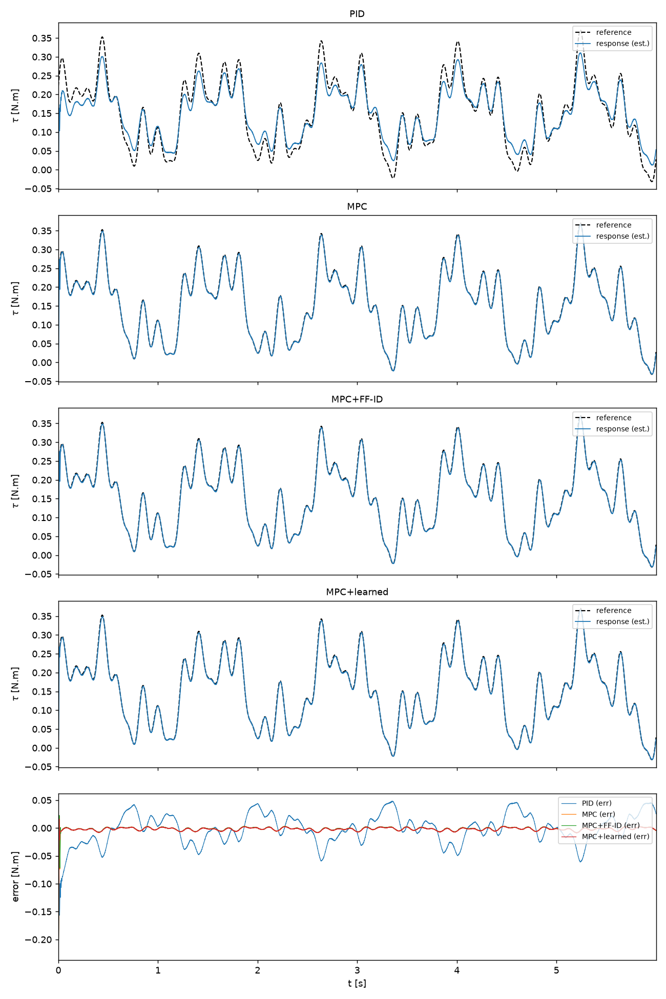
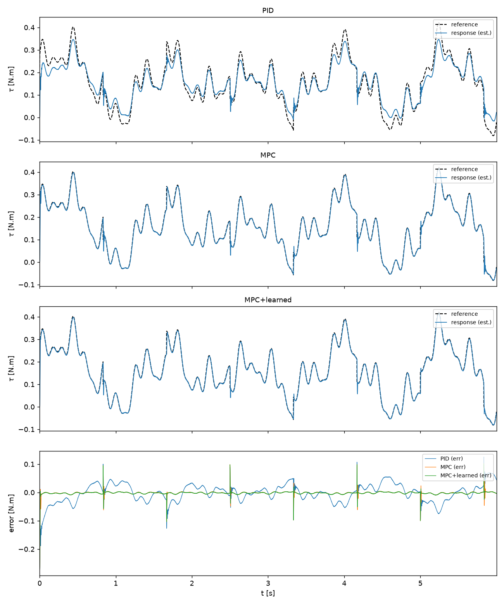
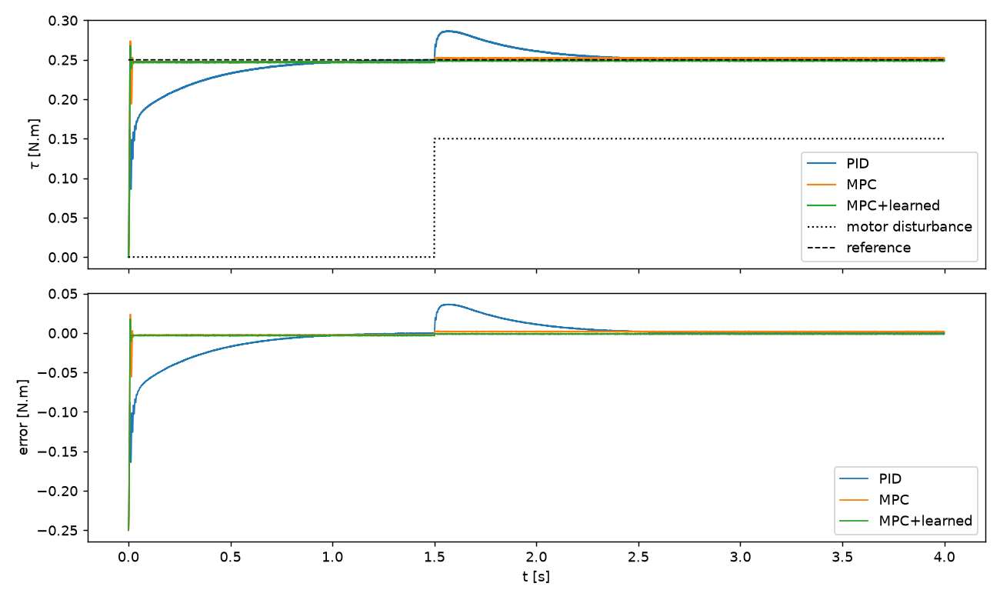
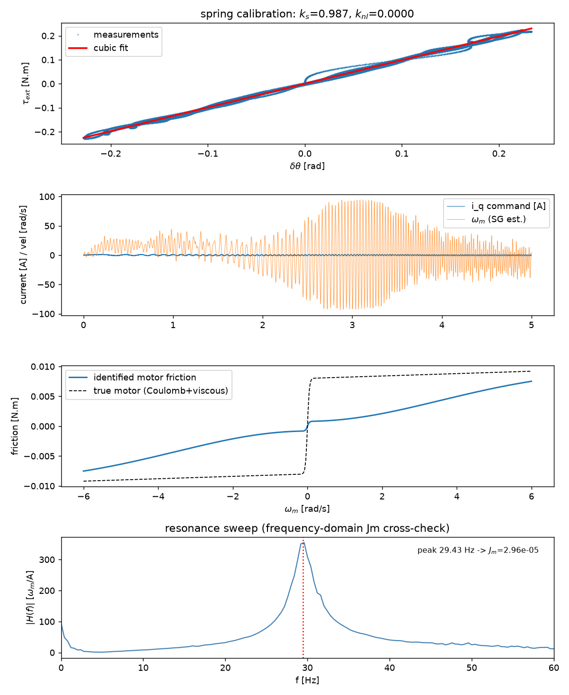
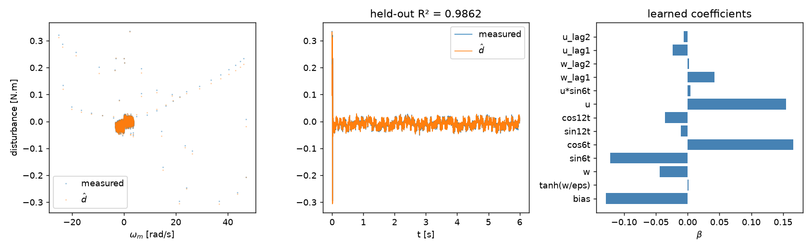
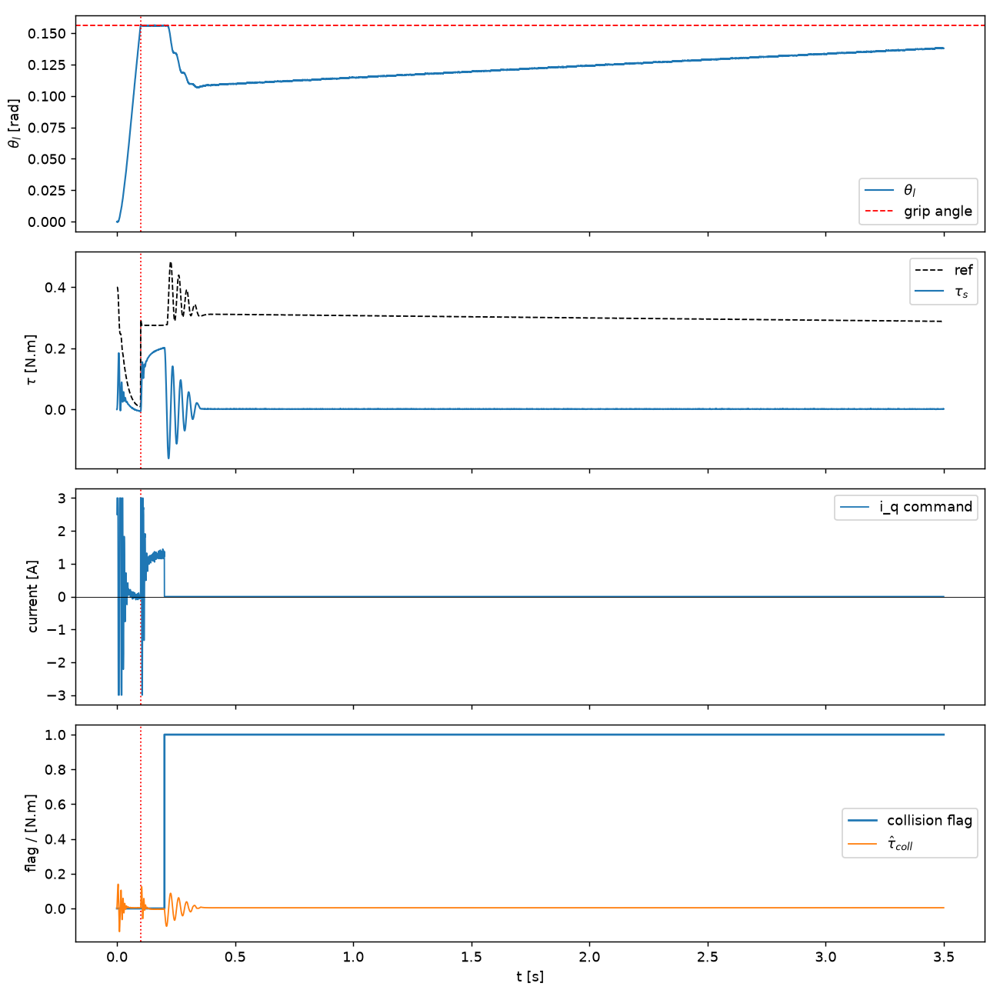

# Results: selected 4015 simulation scenario

This page is generated from [the raw snapshot](../results/results.json) by
`python scripts/summarize_results.py`. All measurements are from simulation.
The plotted data, generated headers, and this table come from the same run.

## Configuration and metric definitions

- Motor scenario: R = 4.8 Ω, L = 0.0026 H,
  Kt = 0.1562 N·m/A, Jm = 3e-05 kg·m².
- MPC: N = 30, T = 0.5 ms,
  current budget = ±3 A, at most 20 ADMM iterations.
- PID uses fixed gains, the same sample period, and the same final current
  budget. This is a comparison of these configurations, not optimal tuning
  of each controller across all possible operating conditions.
- RK4 integration step = 2e-05 s. The torque fixture
  uses stiffness 10000 N·m/rad and damping
  50 N·m·s/rad, included in the MPC prediction model.
- Tracking runs last 6 s. The steady tracking
  metric uses the latter half; overall RMS includes startup and edges.
  Smooth reference has a 0.15 N·m bias with four sine components; the edge
  reference adds a ±0.05 N·m square component.
- Disturbance: +0.15 N·m on the **motor** at t = 1.5 s, while holding a
  0.25 N·m torque reference. Peak error uses [1.5, 1.7) s; steady error is
  **mean absolute error**, not signed bias, over [1.9, 2.2) s.
- Angles include quantization and seeded sensor noise. Velocities and
  current feedback use simulator states. There is no process/thermal drift.

## Controller comparison

| Metric [mN·m] | PID | MPC | MPC + learned FF |
|---|---:|---:|---:|
| Smooth tracking RMS, latter half | 24.77 | 2.98 | 2.98 |
| Smooth tracking RMS, full run | 27.32 | 7.10 | 6.76 |
| Edge-rich tracking RMS, full run | 32.86 | 10.66 | 10.17 |
| Disturbance mean absolute error, steady window | 9.61 | 1.79 | 1.17 |

## Identification and learning

| Identified quantity | Relative error against simulated truth |
|---|---:|
| `Jm` | 1.15% |
| `bm` | 17.42% |
| `Jl` | 1.30% |
| `bl` | 1.53% |
| `ks` | 1.35% |
| `knl` | 0.00% |

Time-domain inertia fitting is cross-checked against the resonance estimate
and fused with a frequency-domain prior. MPC uses the identified motor
inertia; other prediction parameters remain the configured values, with
spring calibration used by the torque observer. This is not a fully
identified, independent hardware model.

Held-out residual-model R² = 0.9862.
Training and evaluation use different trajectories. A high score can include
inertia mismatch and current-loop dynamics; it does not prove a physically
accurate friction map. The separately fitted friction model still needs
validation against hardware data.

## Collision-response demonstration

A simulated grip pins the output at t = 0.1 s.
Detection latency: **101.0 ms**. Maximum absolute estimated torque from
grip onset through the end of the run:
**201.81 mN·m**.
This metric includes the interval before detection, not just the zero-current
response afterward. The collision demo uses a PID inner torque controller,
impedance reference, learned FF, and stall/residual detection; it is separate
from the blocked-output MPC benchmarks.

## Interpretation and limitations

Plain MPC provides the main tracking improvement in this fixture. Learned
feedforward must be judged by closed-loop metrics rather than R² alone;
it shares the current budget and can displace useful control at saturation.
Small differences in a deterministic run do not establish statistical
significance. Retuning PID and testing more fixtures may change the comparison.

Physical actuator performance, STM32 execution timing, sensor/driver faults,
and human interaction remain unverified. The safety mechanism is a modeled
zero-current latch, not a safety certification. MATLAB results have not been
rerun and are not included in this table. See [status and next steps](STATUS.md).
Historical scenarios are retained in [the archive](../results/archive/README.md)
and should not be combined with the current snapshot.
