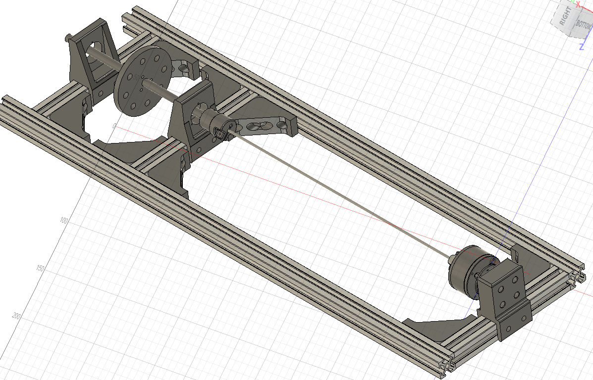

# Custom Fusion parts — current assembly snapshot

Exported from **Full Assembly FOR SEA, version 15**, on 2026-10-07.

These are the modeled prototype parts, with dimensions preserved. They are
not validated manufacturing releases. Supplier motor, extrusion, shaft-collar,
and encoder models are excluded.

| Part | Fusion archive | History | STEP | Print mesh (mm) |
|---|---|---|---|---|
| Torsion bar | [F3D](fusion/torsion_bar.f3d) | Sketches/features | [STEP](step/torsion_bar.step) | Metal stock reference |
| 8 mm load shaft | [F3D](fusion/load_shaft_8mm.f3d) | Sketches/features | [STEP](step/load_shaft_8mm.step) | Metal stock reference |
| Motor hub | [F3D](fusion/motor_hub.f3d) | Editable solid snapshot | [STEP](step/motor_hub.step) | [STL](stl/motor_hub.stl) |
| Load hub | [F3D](fusion/load_hub.f3d) | Editable solid snapshot | [STEP](step/load_hub.step) | [STL](stl/load_hub.stl) |
| Motor mount | [F3D](fusion/motor_mount.f3d) | Editable solid snapshot | [STEP](step/motor_mount.step) | [STL](stl/motor_mount.stl) |
| Bearing block | [F3D](fusion/bearing_block.f3d) | Sketches/features | [STEP](step/bearing_block.step) | [STL](stl/bearing_block.stl) |
| Extrusion bracket | [F3D](fusion/extrusion_bracket.f3d) | Sketches/features | [STEP](step/extrusion_bracket.step) | [Body 1](stl/extrusion_bracket_body_1.stl), [Body 2](stl/extrusion_bracket_body_2.stl) |
| Inertial disk | [F3D](fusion/inertial_disk.f3d) | Sketches/features | [STEP](step/inertial_disk.step) | [STL](stl/inertial_disk.stl) |

The motor hub, load hub, and motor mount contained linked supplier components.
Their public archives contain only the custom solids and do not retain the
source feature timelines. The other five archives retain the source sketches
and features. Every archive opens independently; no Fusion cloud project
access is required. The source assembly was neither edited nor saved.

The bracket has two bodies in the source. Both are preserved and exported as
separate meshes; inspect the small secondary body before choosing print parts.
CAD materials are inherited (mostly Steel). They are placeholders for printed
parts and must not be used to estimate the printed assembly's inertia.

## Current inertial disk

- Outside diameter: **70 mm**; thickness: **6 mm**.
- Shaft bore: **8.2 mm**.
- Weight holes: **8 × 6.4 mm**, equally spaced on a **50 mm bolt circle**.
- Hub fasteners: **3 × 3.2 mm**, on a **16 mm bolt circle**.
- First hub hole is at 90 degrees; the weight holes start at 0 degrees.
- Nominal ground clearance at a 41 mm shaft center: **6 mm**.

Use matched steel washers, **18 mm OD × 6.4 mm ID × nominal 1.6 mm thick**,
centered by printed **6.2 mm OD × 4.3 mm ID × 1.2 mm long** sleeves on M4
studs. Match washer mass within each group and keep equal stacks on both faces.
Keep all eight studs and their retaining hardware installed for the sweep.
Weigh that hardware; the calculation's 10 g per station is a provisional estimate.
A 6.4 mm printed hole should be checked for fit and finished if required.
Neighboring 18 mm washers have about **1.13 mm edge clearance** at this radius;
the washer's outside edge is 1 mm inside the disk rim.

Group A uses 0/90/180/270 degrees; B uses 45/135/225/315 degrees. Increase one
complete quartet at a time, mirrored on both faces. This keeps the ideal disk
and added weights centered, with equal transverse moments and zero products
of inertia. An opposing pair alone is balanced but does not maintain equal
transverse moments. The hub, print variability, and mass mismatches require
separate balance verification.

The [as-modeled sweep](../inertial_disk/as_modeled/calculations.json) provides
**26 nominal settings**, including a bare carrier, and a
[randomized three-repeat run sheet](../inertial_disk/as_modeled/run_manifest.csv).
The maximum uses 12 washers per face at all eight stations (192 total).
Estimated inertia spans **2.63e-5 to 4.39e-4 kg m²**, using a 26.1 g solid PLA
carrier estimate, 2.79 g washers, 10 g retention kits, and a 1e-5 kg m² external
inertia allowance. With retention kits kept installed, the estimated range is
**7.63e-5 to 4.39e-4 kg m²**. These are planning values, not measured data or
validated mass/speed limits. Maximum carrier/weights/kit mass is approximately
647 g; confirm shaft, bearing, hub and printed-part capacity before that setting.

The **75 mm M4 studs** proposed for testing fit the 100 mm axial allowance;
check access and actual fastener lengths in the assembly. Do not use protruding
stud ends as a handle during operation. Retention and a suitable enclosure must
be established before powered tests. No operating speed is rated here.

The [compact and raised designs](../../parts/inertial_disk.md) remain alternatives
for comparison. Their proposed hub pattern differs from this current model.
The raised design provides a larger inertia range but requires raising the
motor and bearing centers. Start with this current disk for the easiest sweep.

## Traceability and verification

[manifest.json](manifest.json) records body dimensions, materials, original
feature counts, omitted supplier children, and SHA-256 hashes for each public
CAD file. [assembly_layout.json](assembly_layout.json) records custom-part
occurrence placement; transform translations are Fusion internal centimeters.
It is an assembly reconstruction reference, not a complete assembly archive.
[verification.json](verification.json) records all 16 native/STEP reimports,
body counts, high-accuracy volume comparisons, and all seven mesh scale checks.
Native history was checked for the five parametric archives. Meshes use
millimeter coordinates and were compared against source body bounds.

To regenerate, open the source assembly and run
[export_custom_parts.py](../export_custom_parts.py) in Fusion's Python scripting
environment. Set `OUTPUT` to your checkout's `hardware/cad/custom` directory.
Revalidate regenerated exports and refresh their manifest hashes before committing.
