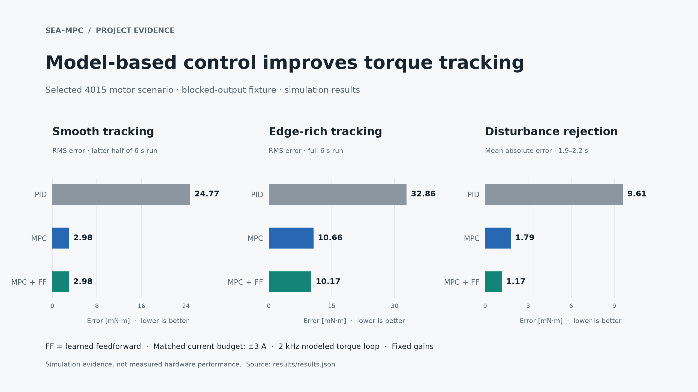
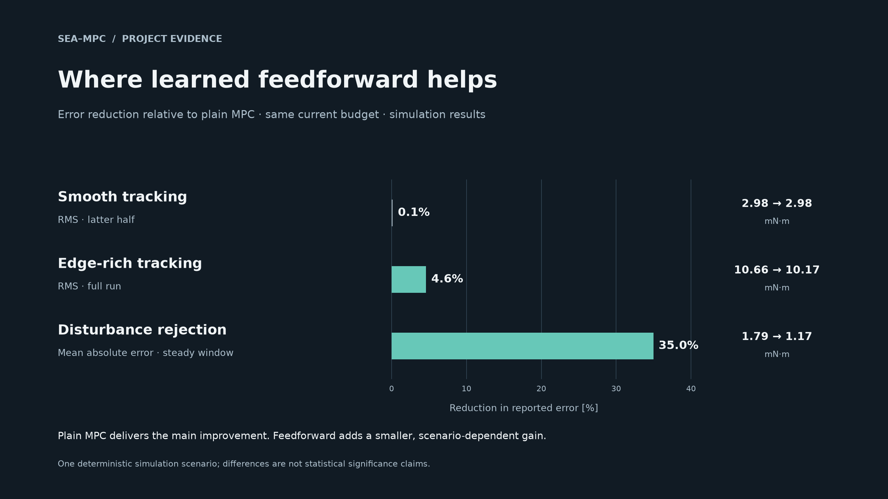
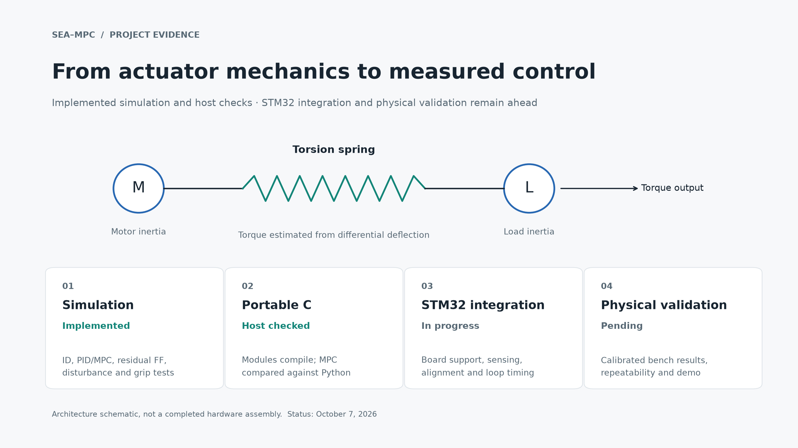

# Website visuals

Three graphics, each in light and dark themes, exported as **2560 × 1440 PNG**
and editable/scalable **SVG**. They use the current simulation snapshot in
`results/results.json`. Use SVG for a crisp website display and PNG for social
previews or platforms that require raster images.

| Graphic | Light PNG | Dark PNG | Light SVG | Dark SVG |
|---|---|---|---|---|
| Controller comparison | [PNG](controller-comparison-light.png) | [PNG](controller-comparison-dark.png) | [SVG](controller-comparison-light.svg) | [SVG](controller-comparison-dark.svg) |
| Learned feedforward | [PNG](learned-feedforward-light.png) | [PNG](learned-feedforward-dark.png) | [SVG](learned-feedforward-light.svg) | [SVG](learned-feedforward-dark.svg) |
| Project progress | [PNG](project-progress-light.png) | [PNG](project-progress-dark.png) | [SVG](project-progress-light.svg) | [SVG](project-progress-dark.svg) |

## Suggested captions and alt text

**Controller comparison caption:** Simulation of the selected 4015
series-elastic actuator scenario: constrained MPC improves torque tracking
relative to a fixed PID configuration, with both controllers sharing a ±3 A
current budget. Hardware validation remains in progress.

**Alt text:** Three bar charts compare PID, MPC, and MPC with learned
feedforward. Smooth tracking RMS is approximately 24.77, 2.98, and 2.98 mN·m;
edge-rich full-run RMS is 32.86, 10.66, and 10.17 mN·m; steady disturbance
mean absolute error is 9.61, 1.79, and 1.17 mN·m. All are simulation results.

**Feedforward caption:** Learned feedforward has nearly no effect on smooth
tracking in this run, reduces edge-rich overall RMS by about 4.6%, and
reduces steady disturbance mean absolute error by about 35%. These gains are
scenario-dependent and have not been established on hardware.

**Alt text:** Relative to plain MPC, learned feedforward reduces smooth
tracking error by about 0.1%, edge-rich overall error by 4.6%, and steady
disturbance error by 35% in one simulation scenario.

**Progress caption:** The actuator model, identification pipeline, and
controller comparisons are implemented in simulation. Portable C modules
compile on a host, with MPC checked against Python; STM32 integration and
physical validation are the next stages.

**Alt text:** A motor and load connected by a torsion spring, followed by
four stages: simulation implemented, portable C host checked, STM32
integration in progress, and physical validation pending.

## Update and usage

Regenerate with `python scripts/website_visuals.py` after updating the published
snapshot. Keep the built-in simulation labels when using the graphics outside
the repository. SVG text uses DejaVu Sans with normal font fallback; PNG fixes
the appearance regardless of the site's fonts. Detailed source definitions
and uncertainty limits are in [the results report](../../docs/RESULTS.md).

